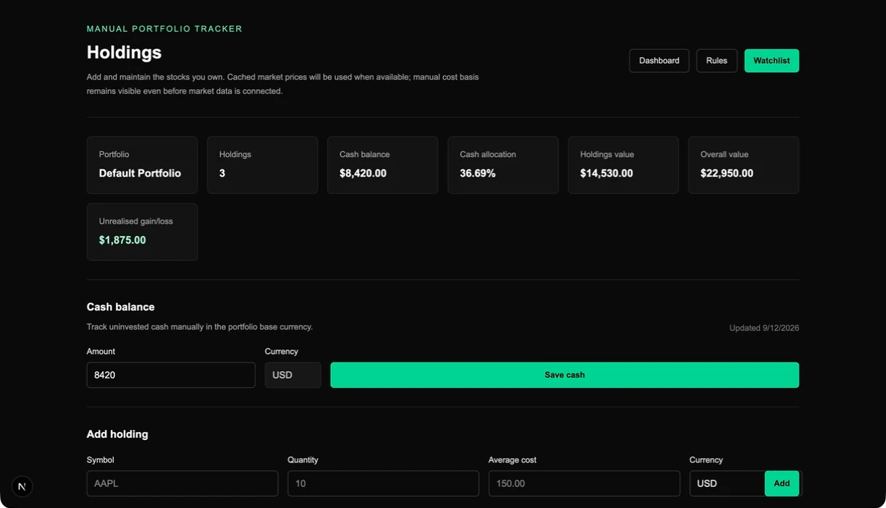

# Assets Watcher

Assets Watcher is a multi-user stock-portfolio intelligence prototype for tracking US-listed holdings and watchlist ideas. It turns cached market data and transparent, deterministic rules into educational context—not trading instructions.

## Why I built it

I wanted to explore the engineering boundaries of a personal-finance product: user-owned data, scheduled third-party data refreshes, explicit data freshness, and explainable scoring. The product deliberately keeps the decision with the user; its labels and optional AI explanation are informative rather than prescriptive.

## What it does

- Authenticates users and creates a default portfolio.
- Lets users maintain a cash balance, holdings, and a separate watchlist.
- Shows cached company, price, fundamentals, allocation, valuation, quality, safety, and portfolio-fit context.
- Makes cached data freshness visible and supports controlled market-data refresh paths rather than fetching on every page render.
- Applies deterministic scoring rules with stored, user-scoped score snapshots.
- Can generate an on-demand AI take from the app's structured portfolio snapshot, while keeping the deterministic engine as the source of truth.

## Technical highlights

- **Clear domain boundaries.** Market-data providers, scoring, portfolios, holdings, watchlists, authentication, and AI each live behind focused modules.
- **Safe financial-product language.** The scoring model uses cautious labels such as `Attractive`, `Watch`, and `Avoid / Review`; it does not issue buy or sell recommendations.
- **Protected multi-user data.** Supabase Auth, Postgres, row-level security, user-scoped queries, and database migrations model the ownership boundary.
- **Testable business logic.** The repository includes unit and page tests around validation, scoring thresholds, cached-data handling, portfolio calculations, user rules, scheduled refreshes, and provider adapters.
- **Controlled integrations.** Server-only credentials are used for Financial Modeling Prep, scheduled refresh authorization, Supabase administration, and Gemini; the browser does not receive them.

## Key decisions and trade-offs

- The app stores and displays cached market snapshots rather than presenting an implied live feed. Freshness states make the limitation explicit.
- Deterministic rules are separated from the optional AI explanation, which receives a bounded structured snapshot rather than authority to invent financial facts.
- The first scope is intentionally US stocks and manual tracking, which keeps the data model and market-data integration focused.
- A full local backend is useful for schema work, but normal browser development can use a hosted Supabase project to avoid a Docker dependency.

## Tech stack

- Next.js App Router and React
- TypeScript and Tailwind CSS
- Supabase Auth and Postgres
- Vitest and ESLint
- Financial Modeling Prep market-data adapter
- Gemini AI provider adapter

## Status

This is an in-progress prototype. Its authenticated portfolio, holdings, watchlist, stock-detail, scoring, user-rule, cached-market-data, and on-demand AI pathways are implemented in the repository. The wider product roadmap remains in [docs/product-plan.md](./docs/product-plan.md).

## Screenshots

Local demo data makes the core portfolio state easy to inspect without relying on a live market-data provider.

### Holdings

## Running the project

See [HOW_TO_USE.md](./HOW_TO_USE.md) for prerequisites, environment variables, local setup, database work, and verification commands.
